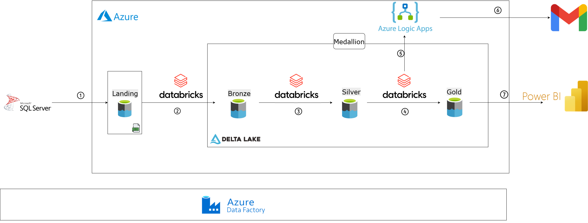

# Azure ETL Pipeline for Business Intelligence


An end-to-end, automated data platform built on Microsoft Azure to ingest, process, and analyze on-premise sales data. This project implements a modern data warehousing solution using the Medallion Architecture, providing business intelligence-ready data while maintaining a full historical record of all changes. The entire workflow is orchestrated by Azure Data Factory, processing multiple tables dynamically and efficiently.

---

## Table of Contents
1.  [Business Objectives](#business-objectives)
2.  [High-Level Architecture](#high-level-architecture)
3.  [Component Deep Dive & Data Flow](#component-deep-dive--data-flow)
    - [Phase 1: Dynamic & Incremental Ingestion (ADF)](#phase-1-dynamic--incremental-ingestion-adf)
    - [Phase 2: Raw Structuring - Bronze Layer](#phase-2-raw-structuring---bronze-layer)
    - [Phase 3: Business Logic & History - Silver Layer](#phase-3-business-logic--history---silver-layer)
    - [Phase 4: Aggregation & BI - Gold Layer](#phase-4-aggregation--bi---gold-layer)
    - [Phase 5: Automated Actions](#phase-5-automated-actions)
4.  [Data Model Highlights](#data-model-highlights)
5.  [Key Technical Features](#key-technical-features)
6.  [Technology Stack](#technology-stack)
7.  [Configuration & Environment](#configuration--environment)
8.  [Error Handling & Logging](#error-handling--logging)
9. [Setup and Deployment](#setup-and-deployment)

---

## 1. Business Objectives
-   **Modernize Data Infrastructure:** Migrate data processing from a capacity-constrained on-premise environment to a scalable cloud platform on Azure.
-   **Enable Self-Service BI:** Provide business analysts with clean, reliable, and aggregated data marts in the Gold Layer, empowering them to build their own reports in Power BI without needing complex data prep.
-   **Achieve a 360-Degree Historical View:** Implement SCD Type 2 to track all historical changes to key entities like customers and products, enabling accurate trend analysis and auditing.
-   **Automate Business Processes:** Automatically trigger actions, such as sending welcome emails to new customers, based on real-time data events detected within the pipeline.

---

## 2. High-Level Architecture

The platform is orchestrated by a single Azure Data Factory pipeline that dynamically handles data processing from ingestion to analytics.



---

## 3. Component Deep Dive & Data Flow

### Phase 1: Dynamic & Incremental Ingestion (ADF)

The core of the ingestion process is a master ADF pipeline that dynamically handles multiple tables.

**1. `Get Table List` (Lookup Activity)**
-   **Purpose:** To fetch the list of tables to be processed. This makes the pipeline metadata-driven.
-   **Configuration:** Executes a simple SQL query against a control table.
    ```sql
    SELECT SchemaName, TableName FROM dbo.ControlTable_TableList WHERE IsActive = 1;
    ```
-   **Output:** A JSON array of table objects, which is passed to the `ForEach` activity.

**2. `ForEach Table` (ForEach Activity)**
-   **Purpose:** To loop through the list of tables from the previous step and execute the ingestion logic for each one.
-   **Configuration:** The `Items` property is set to the output of the `Get Table List` activity: `@activity('Get Table List').output.value`.

    *Inside the loop, the following activities run for `@item().TableName`*:

    **2a. `Get Old Watermark` (Lookup Activity)**
    -   **Purpose:** Fetches the last successfully processed timestamp (`UpdatedAt` value) for the current table in the loop.
    -   **Configuration:** Dynamically queries the watermark control table.
        ```sql
        SELECT WatermarkValue FROM dbo.ControlTable_Watermarks WHERE TableName = '@{item().TableName}';
        ```

    **2b. `Get New Watermark` (Script Activity)**
    -   **Purpose:** Determines the upper bound for the current ingestion window.
    -   **Configuration:** Executes a query to get the latest `UpdatedAt` value from the source table.
        ```sql
        SELECT MAX(UpdatedAt) AS NewWatermarkValue FROM @{item().SchemaName}.@{item().TableName};
        ```
    
    **2c. `Copy Data` (Copy Data Activity)**
    -   **Purpose:** Extracts only the changed/new data and lands it in ADLS.
    -   **Source Configuration:** Uses a dynamic SQL query with parameters from the previous lookup activities.
        ```sql
        SELECT * FROM @{item().SchemaName}.@{item().TableName} 
        WHERE UpdatedAt > '@{activity('Get Old Watermark').output.firstRow.WatermarkValue}' 
        AND UpdatedAt <= '@{activity('Get New Watermark').output.firstRow.NewWatermarkValue}';
        ```
    -   **Sink Configuration:** Lands the data as a CSV file in the `landing` container with a dynamic name.
        -   **Path:** `landing/@{item().TableName}/`
        -   **Filename:** `@concat(item().TableName, '_', utcnow(), '.csv')`

    **2d. `Update Watermark` (Script Activity)**
    -   **Purpose:** To update the watermark control table upon successful data copy, ensuring transactional consistency for the next run.
    -   **Configuration:** Executes an `UPDATE` or `MERGE` statement.
        ```sql
        MERGE dbo.ControlTable_Watermarks AS T
        USING (SELECT '@{item().TableName}' AS TableName, '@{activity('Get New Watermark').output.firstRow.NewWatermarkValue}' AS NewWatermark) AS S
        ON T.TableName = S.TableName
        WHEN MATCHED THEN
            UPDATE SET T.WatermarkValue = S.NewWatermark
        WHEN NOT MATCHED THEN
            INSERT (TableName, WatermarkValue) VALUES (S.TableName, S.NewWatermark);
        ```

### Phase 2: Raw Structuring - Bronze Layer

**Notebook: `1_Landing_to_Bronze.py`**
-   **Purpose:** To convert the raw, schema-less CSV files from the landing zone into structured, partitioned, and queryable Delta tables.
-   **Input:** CSV files in the `landing` container.
-   **Logic:**
    1.  **Scan Landing Zone:** Lists all sub-directories (one for each table) in the `landing` container.
    2.  **Process Each Table:** For each directory, it reads all new CSV files.
    3.  **Schema Inference & Evolution:** For the first run, it infers the schema. For subsequent runs, it uses the existing Delta table's schema and enables schema evolution (`.option("mergeSchema", "true")`) to handle new columns gracefully.
    4.  **Add Audit Columns:** Enriches the data with critical metadata for traceability.
        ```python
        from pyspark.sql.functions import current_timestamp, input_file_name
        
        df_with_metadata = df.withColumn("ingestion_timestamp", current_timestamp()) \
                             .withColumn("source_file", input_file_name())
        ```
    5.  **Write to Bronze:** Appends the enriched DataFrame to the corresponding Delta table in the `bronze` container. Data is often partitioned by ingestion date for efficiency.
-   **Output:** Partitioned Delta tables in the `bronze` container.

### Phase 3: Business Logic & History - Silver Layer

**Notebook: `2_Bronze_to_Silver.py`**
-   **Purpose:** To apply data quality rules, merge data, and build a complete historical view using SCD Type 2 logic.
-   **Input:** New data from Bronze tables (filtered by `ingestion_timestamp` using a watermark).
-   **Logic for each Dimension Table:**
    1.  **Read Incremental Source (Bronze) & Full Target (Silver):** Reads new data from Bronze and the *current* records (`WHERE is_current = true`) from the Silver Delta table.
    2.  **Create Hash Column:** Creates a SHA2 hash of all business columns (excluding keys and timestamps) for both source and target DataFrames. This provides an efficient way to detect row-level changes.
        ```python
        from pyspark.sql.functions import sha2, concat_ws, col
        
        tracked_cols = ["Name", "Email", "Address", ...] # Example for Customers
        source_df = source_df.withColumn("hash", sha2(concat_ws("||", *tracked_cols), 256))
        target_df = target_df.withColumn("hash", sha2(concat_ws("||", *tracked_cols), 256))
        ```
    3.  **Identify Changes:** Uses a `FULL OUTER JOIN` on the primary key to identify three types of records:
        -   **New Records:** Exist in the source but not the target.
        -   **Updated Records:** Exist in both, but their `hash` values differ.
        -   **Deleted Records (Optional):** Exist in the target but not the source.
    4.  **Perform `MERGE` into Silver:** The core of SCD2 is implemented using Delta Lake's powerful `MERGE` command.
        -   `WHEN MATCHED AND source.hash <> target.hash`: This is an update. The `MERGE` operation updates the old record in the Silver table, setting `is_current = false` and `end_date = current_timestamp()`.
        -   The new version of the changed record (along with brand new records) is then inserted into the Silver table with `is_current = true` and a new `effective_date`.
    5.  **New Customer Identification:** For the `Customers` table, records identified as "New" are written to a separate temporary Delta table (`new_customers_for_emailing`) that ADF will use later.
-   **Output:** Cleansed, integrated, and historical Delta tables in the `silver` container.

### Phase 4: Aggregation & BI - Gold Layer

**Notebook: `3_Silver_to_Gold.py`**
-   **Purpose:** To create denormalized and aggregated data marts optimized for analytical querying.
-   **Input:** Cleaned tables from the `silver` container.
-   **Logic:**
    1.  **Read Current Silver Views:** Reads data from all necessary Silver tables, always filtering `WHERE is_current = true` to work with the latest version of the dimensions.
    2.  **Perform Joins:** Joins fact tables (like `Orders`) with multiple dimension tables (like `Customers`, `Products`, `Sellers`) to create a flat, wide table (`fact_order_details`).
    3.  **Calculate Aggregations:** Creates pre-aggregated tables, for example, `sales_summary_by_seller_monthly`.
        ```python
        from pyspark.sql.functions import sum, count, month, year

        sales_summary = fact_details.groupBy("SellerID", "SellerName", year("OrderDate"), month("OrderDate")) \
                                    .agg(sum("TotalAmount").alias("total_revenue"), 
                                         count("OrderID").alias("number_of_orders"))
        ```
    4.  **Write to Gold:** Overwrites the aggregated tables in the `gold` container. This layer is the single source of truth for all BI reporting.
-   **Output:** Aggregated data mart Delta tables in the `gold` container.

### Phase 5: Automated Actions

**1. `Get New Customers List` (Lookup Activity)**
-   **Purpose:** To retrieve the list of customers that were identified as "new" in the current pipeline run.
-   **Configuration:** Reads the `new_customers_for_emailing` Delta table created by the Silver notebook.

**2. `ForEach New Customer` (ForEach Activity)**
-   **Purpose:** To loop through each new customer and trigger an email.

    **2a. `Send Welcome...` (Web Activity)**
    -   **Purpose:** To call the Logic App HTTP trigger.
    -   **Configuration:**
        -   **URL:** The HTTP POST URL from the Azure Logic App.
        -   **Method:** `POST`
        -   **Body:** A JSON payload constructed dynamically using the current item from the loop.
            ```json
            {
                "email": "@{item().Email}",
                "name": "@{item().Name}"
            }
            ```

---

## 4. Data Model Highlights
-   **Bronze Layer:** Contains exact copies of source data plus audit columns (`ingestion_timestamp`, `source_file`).
-   **Silver Layer:** Tables are enriched with SCD Type 2 columns to manage history:
    -   `is_current` (boolean): `true` if this is the most recent version of the record.
    -   `effective_date` (timestamp): The timestamp when this version of the record became valid.
    -   `end_date` (timestamp): The timestamp when this version of the record was superseded (NULL for current records).
-   **Gold Layer:** Consists of denormalized fact tables and aggregated summary tables, designed for direct consumption by BI tools.

---

## 5. Key Technical Features
-   **Dynamic Multi-Table Processing:** The pipeline is metadata-driven, capable of processing any number of tables.
-   **Robust Incremental Loading:** Implements a transactionally safe high-watermark strategy for reliable change data capture.
-   **Full Historical Tracking (SCD Type 2):** Preserves a complete history of all dimensional changes using Delta Lake's `MERGE` capability.
-   **Scalable Medallion Architecture:** Ensures data quality, governance, and separation of concerns.
-   **Reliable Data Lakehouse:** Uses Delta Lake to bring ACID transactions, versioning, and reliability to the data lake.
-   **Automated Business Actions:** Integrates with Logic Apps to trigger real-world actions based on data events.

---

## 6. Technology Stack
* **Orchestration:** Azure Data Factory
* **Data Processing:** Databricks, Apache Spark (PySpark)
* **Data Storage:** Azure Data Lake Storage Gen2, Delta Lake
* **Database:** Microsoft SQL Server
* **BI & Automation:** Power BI, Azure Logic Apps
* **Languages:** Python (PySpark), SQL

---

## 7. Configuration & Environment
-   **Azure Key Vault:** Is used to securely store all secrets, including:
    -   SQL Server Connection String
    -   Databricks Personal Access Token (PAT)
    -   Service Principal credentials for ADLS access.
-   **ADF Global Parameters:** Used for non-sensitive, environment-specific configurations like storage account names, container names, and resource group names.

---

## 8. Error Handling & Logging
-   **ADF:** Native support for activity retries and timeouts is configured. Failed activities can be configured to trigger email alerts.
-   **Databricks:** Notebooks use `try...except` blocks to catch errors. Errors are logged to a dedicated logging table and can be configured to fail the ADF pipeline activity, preventing downstream processing.
-   **Azure Monitor:** All ADF and Databricks logs are funneled to an Azure Monitor Log Analytics workspace for centralized monitoring and alerting.


---

## 9. Setup and Deployment
1.  **Deploy Azure Resources:** Use ARM templates or Terraform to provision all necessary Azure resources.
2.  **Configure Access:** Grant the ADF Managed Identity necessary permissions on ADLS Gen2 and Key Vault.
3.  **Setup Database:** Run the scripts in `/sql_scripts` to prepare the source SQL Server database.
4.  **Deploy Code:** Publish the ADF pipeline from the `/adf` folder and upload the notebooks to the Databricks workspace.
5.  **Configure Pipeline:** Set up the ADF Global Parameters and ensure all Linked Services connect successfully using credentials from Key Vault.
6.  **Initial Run:** Trigger the pipeline manually. The first run will perform a full load if the watermark table is empty. Subsequent runs will be incremental.

---
